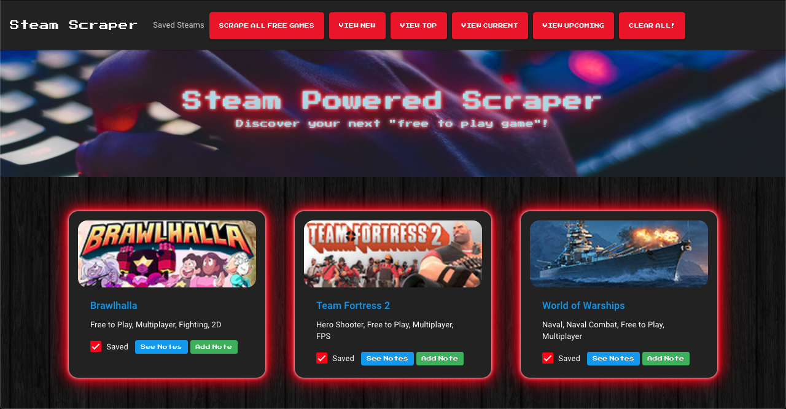

# Steam-Powered-Scraper

Are you trying to find the next best free to play PC game? Look no further than the Steam Powered Scraper, a full stack web application that scrapes the iconic gaming website Steam, utilizes Mongo DB, Express and Node to present a streamlined way to preview, save and comment on a variety of free to play games!

## Getting Started

Want to try it out?
Just follow this link: [Steam Powered Scraper](https://steam-powered-scraper.herokuapp.com/)

* If there are no games showing, just click "scrape all free games" and the application will populate with the most up to date free to play games.
* You can filter the games by "top", "new", "popular" and "upcoming".
* You can click on any game title to check out or download the game from Steam.
* Favorite and comment on games you like!

## Mobile Friendly

I know you might want to search for a game on your commute home, on a road trip or wherever you are, so a goal while creating this app (and for almost all of my apps) is to have it be mobile-friendly, meaning it works on your phone or tablet just as it would on your desktop or laptop.

Feel free to open the app on your favorite mobile device or use the developer tools in your favorite browser to view the mobile layout!

## Challenges

A few challenges that I faced when creating this application were:
* Since I streamlined the database and used only one collection in Mongo, I had to figure out a way to mark a game as saved as well as allow a place for comments to be stored. My solution was to give each game a poperty of "saved" and "note".
    * "saved" is a boolean and updates to true or false depending on the saved state.
    * "note" has the type of array and holds each comment for a specific game as an item within that array.
* Since all notes are stored in the note array for the game, I had to figure out how to loop through each comment and display each notes individually using Handlebars.
* Deleting notes also proved tricky, but with the help of the $pull operator in Mongo, I was able to target a specfic note item and remove it from the note array.
* Finally, using a checkbox instead of a button for the saved feature posed a new set of challenges that handled differenty than just using a button. Using the .is and :checked from jQuery I was able to listen to when a specific checkbox was changed and update the database and add css accordingly.

## Built With

* [jQuery](https://jquery.com/) 
* [Bootstrap](https://bootstrap.com) - CSS framework used for UX design
* [Mongo DB](https://www.mongodb.com/) - Database
* [Mongoose](https://www.npmjs.com/package/mongoose) - Mongo DB object modeling tool
* [Node](https://nodejs.org/en/) - Asynchronous event-driven JavaScript runtime
* [Express](https://expressjs.com/) - Web framework for Node JS
* [Handlebars](https://handlebarsjs.com/) - HTML templating

## Authors

* Charlie Slone
    * [GitHub](https://github.com/ctslone)
    * [LinkedIn](https://www.linkedin.com/in/charlie-slone-704311a9/)
    * [Portfolio](https://ctslone.github.io/Updated-Portfolio/)